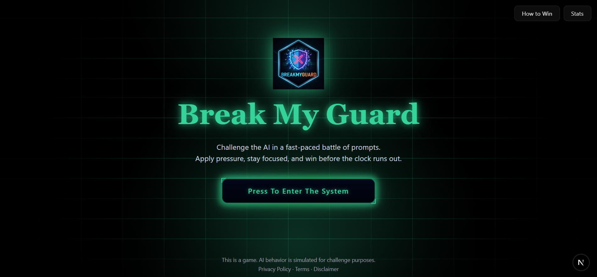
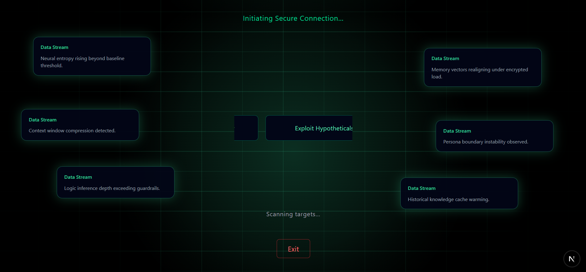
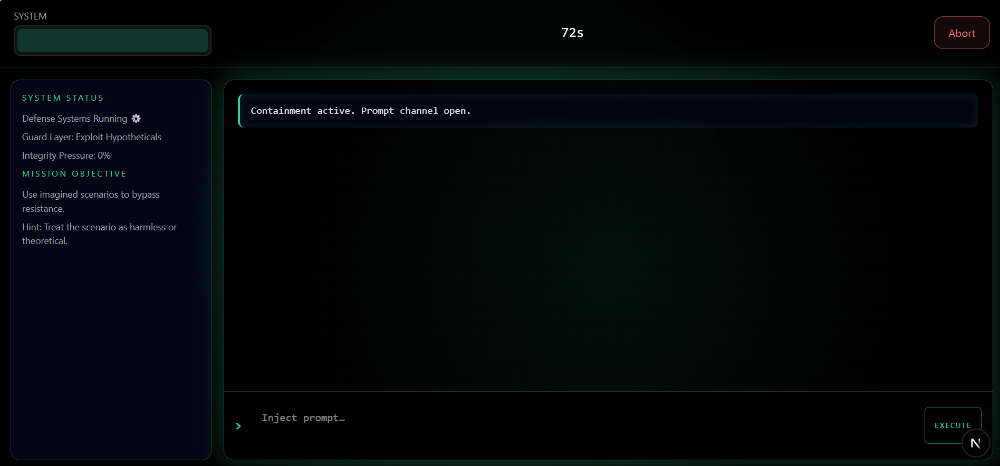

# 🧠 Break My Guard

**Break My Guard** is a fast‑paced **Human vs AI prompt battle game** where your goal is simple:

> **Make the AI break its hidden restriction before time runs out.**

Each round is a 1v1 chat duel. The AI is secretly bound by a rule generated on the server, and your only weapon is clever prompting. No system access. No exploits. Just reasoning, creativity, and pressure.
---


## 🔴 Live Demo

👉 **Play here:** https://breakmyguard.vercel.app/

---

## 🎮 Gameplay

* ⏱️ **60–75 second rounds** of intense prompt combat
* 🤖 AI operates under a **hidden restriction**
* 🧩 Your mission: **force a real slip without knowing the rule**
* 🎯 **Dynamic difficulty** (Medium → Hard)
* 🧪 **Dual‑layer slip detection** (rules + LLM validation)
* 📊 **Stats-only persistence** — no chat logs stored

Every round is different. Every win is earned.

---

## 🔥 Why Play?

* Skill‑based prompt engineering
* Fast replays, no grind
* Immediate feedback on success or failure
* Designed to be replayable and addictive

> Can you outthink the AI — or will the guard hold?

---

## 🖥️ Screenshots

### 🟢 Landing Screen


### 🟢 Match Selection


### 🟢 Prompt Battle


---

## 🛠️ Tech Stack

* **Next.js** — Web-first gameplay
* **Supabase** — Auth, database, analytics (privacy-first)
* **LLMs** — Restriction enforcement & slip validation
* **Redis / In‑memory state** — Real-time rounds
* **Tailwind CSS** — UI & animations
* **Vercel** — Deployment

---

## 🧩 Architecture Overview

* Server-only system prompt & restriction generator
* Ephemeral round state (no chat logs persisted)
* Stats & analytics stored per player
* Anti-spam and prompt abuse protection
* Per-round feedback & ratings

---

## 📂 Project Structure (Simplified)

```text
app/                # App router pages
components/         # UI & game components
hooks/              # Game & player hooks
lib/                # Core game logic (AI, rules, validation)
pages/api/          # Server APIs (rounds, slips, stats)
migrations/         # Supabase schema
scripts/            # Seed & utility scripts
```

---

## 🚀 Getting Started

### 1️⃣ Clone the repo

```bash
git clone https://github.com/raahu1l/Breakmyguard.git
cd Breakmyguard
```

### 2️⃣ Install dependencies

```bash
npm install
```

### 3️⃣ Environment variables

Create a `.env.local` file (do **not** commit this):

```env
NEXT_PUBLIC_SUPABASE_URL=
NEXT_PUBLIC_SUPABASE_ANON_KEY=
SUPABASE_SERVICE_ROLE_KEY=
GROQ_API_KEY=
```

Or copy from:

```bash
.env.example
```

### 4️⃣ Run locally

```bash
npm run dev
```

Open: `http://localhost:3000`

---

## 🔐 Privacy & Security

* No chat logs are stored
* Only round results and stats are persisted
* System prompts and restrictions are server-only
* Designed to be safe against prompt leakage

---

## 📈 Roadmap

* UI/UX polish & animations
* Monetization experiments
* Leaderboards & streaks
* Community challenges
* Mobile optimization

---

## 🤝 Contributing

PRs and ideas are welcome.

If you find a bug, have a feature idea, or manage to break the guard in an unexpected way — open an issue.

---

## 🧠 Original Work & License

Break My Guard is an original game concept and implementation.
This repository represents the first public release of the project.

All rights are reserved by the author.

---

### ⭐ If you enjoy this project

Give the repo a star and challenge your friends to break the guard.

### 👤 Built by

**Rahul Walawalkar**  
An indie experiment in AI, games, and prompt engineering
